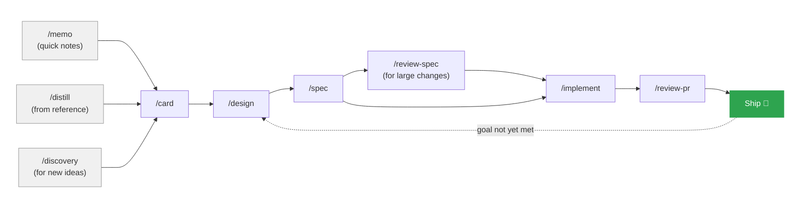

# orbit

An opinionated specification-driven workflow for [Claude Code](https://claude.ai/claude-code).

> Early Release — Orbit is under active development. Expect breaking changes to schemas, CLI arguments, library APIs, and model formats between releases. Pin to a specific version if stability matters for your use case.

## Repository layout

- `plugins/orb/` — the plugin shipped to Claude Code: skills, hooks, plugin metadata.
- `orbit-state/` — Rust workspace producing the `orbit` CLI and MCP server (substrate behind the skills).
- `.orbit/` — orbit's own dogfooded artefacts (cards, choices, specs, memories) — orbit uses itself.
- `.claude-plugin/marketplace.json` — marketplace manifest for installing the plugin.
- `CLAUDE.md`, `.orbit/METHOD.md`, `.orbit/STYLE.md` — the contract every session loads.
- `README.md`, `CHANGELOG.md`, `LICENSE` — top-level docs.

## Why a workflow at all?

Agents have gravity. Context windows fill, sessions end, and there's a constant pull toward closing things out, sometimes by taking shortcuts, sometimes by quietly making decisions that were never yours to delegate. That pull isn't a flaw; it's how agents get work done. But left unchecked, it drifts the software away from what you actually wanted.

Orbit is scaffolding that works *with* that gravity rather than against it. It keeps work moving forward without letting it sail off into space. The trick is artefacts: every stage produces a small, durable file (a card, an interview, a spec, a progress tracker) that survives context loss and hands cleanly to the next step. When a session ends mid-implementation, the next one picks up from the artefact, not from memory.

## Four pillars

Orbit is built around four user outcomes. Everything else is means.

- **Executive-level interaction.** You have a clear vision but are managing multiple things. You don't have time to digest each artefact. Orbit's output is concise and actionable; agents pay the compression cost so you don't.
- **Agent self-learning.** Agents save their own memory and grow their skillset. Facts discovered in one session are available in the next. Recurring procedures accrete into skills.
- **Agent state-persistence.** Durable state keeps agents on track through context loss, session death, and parallel work. You won't read most of it — its job is to serve the agent so the agent can serve you.
- **Long-running R&D.** Agents do a full session's work before checking in. You get time to dive deep when you check in, rather than course-correcting every few minutes. Start/stop is what kills progress.

These four are the test. If a feature doesn't move at least one of them, it doesn't belong in orbit.

## You decide, orbit executes

Orbit draws a clear line between the parts that need your judgement and the parts an agent should work out for itself.

| You decide | Orbit executes |
|------------|----------------|
| What the software should do, and why | How to structure the implementation |
| Which trade-offs matter | Which patterns fit the codebase |
| What "done" looks like | Whether the tests cover the ACs |
| Priorities between competing goals | Edge cases the spec didn't name |

Throughout the skills, the human driving the workflow is called **the author** — the person with vision, priorities, and final say on trade-offs. The agent derives implementation from evidence; the author decides what to build and why.

Your job is vision and decisions. The agent's job is to derive implementation from evidence: prior research, benchmarks, the codebase, the spec. When evidence is genuinely silent or contradictory, orbit stops and asks you. When it isn't, it doesn't waste your time confirming what the data already says.

This isn't ceremony. It's a division of labour that plays to each side's strengths.

## Getting a card: four ways in

Every piece of work in orbit becomes a **card**: a short YAML file describing who needs something, why it matters, and what they'd expect to see. Cards are the intake layer, and there's no single "right" way to produce one.

- **`/card`**: you know what you want. Answer a few questions, get a card.
- **`/memo`**: jot a rough idea as freeform markdown and have it filed in `.orbit/memos/`. The session hook will surface outstanding memos until you distill them.
- **`/distill`**: you've got some reference material (meeting notes, research or an existing project). Distill extracts candidate cards from it and presents them as a batch for your review.
- **`/discovery`**: the idea is big and new. A Socratic Q&A session explores it until a card can be written.

Whichever door you come in, you land in the same place: a card ready for `/design`, then `/spec`, then implementation. Some capabilities ship in a single pass; others take multiple specs — each design session reads the cumulative progress and anchors on what remains.

## A feature, end to end

Here's what it looks like to take a rough idea through to a merged change.

You've been thinking about adding progress indicators to a long-running pipeline. You run `/memo` and jot down the gist: *"Analysts can't tell if jobs are stuck or just slow. Need visible progress."* It's filed in `.orbit/memos/` automatically.

Next session, the hook surfaces it: *"1 outstanding memo in .orbit/memos/"*. You run `/distill .orbit/memos/2026-04-07-pipeline-progress.md` and the agent extracts a candidate card, showing it to you for approval. You tweak a scenario, approve it, and it's saved as `.orbit/cards/0004-pipeline-progress.yaml`.

Now `/design .orbit/cards/0004-pipeline-progress.yaml` opens a focused session. The agent has already searched prior specs and surfaces what's relevant (*"earlier work found stdout flushing is the bottleneck; treating that as a constraint"*) and asks only the questions evidence can't answer. Four questions later, you have an interview.

`/spec` turns the interview into a structured spec with numbered acceptance criteria. It's a STANDARD-tier change, so no spec review needed. You run `/implement .orbit/specs/2026-04-07-pipeline-progress/spec.yaml` and the agent reads the spec, writes a progress tracker, and starts work. Halfway through, it hits a decision the spec didn't cover and stops to ask rather than guess.

When it's done, `/review-pr` runs in a fresh context, reads the diff cold, checks every AC has a matching test, and reports back. Merge.

Six commands. No re-explaining the feature mid-session. No manually cross-checking tests against requirements. No wondering which decisions the agent made silently.

That's the simple case — one spec, one ship. For capabilities that take longer, the loop continues: after shipping, you return to `/design` for the same card. The design session reads the card's `specs` array, summarises what prior work achieved, and anchors on the gap between current state and goal. Each pass adds a spec to the array and advances the card's maturity. Not every pass is linear — some specs approach the goal from different angles (infrastructure, data quality, tooling) rather than continuing the last spec's thread.

## What this saves you

- **Tokens**: constraints re-inject at session start, so you don't pay to re-explain them every time context resets.
- **Time on QA**: ACs are linked to tests by naming convention (`ac-03` → `ac03_*`), and `/audit` checks coverage across all specs in one pass — distinguishing real gaps from non-code deliverables.
- **Re-interviewing**: distill turns existing notes into cards in one pass, rather than starting the conversation over.
- **Silent decisions**: unspecced choices surface as checkpoints, so you find out at the moment they're made, not three commits later.
- **Confirmation bias in review**: review skills fork into fresh sessions with no shared history, catching things a same-session reviewer would wave through.

## Workflow



### Workflow skills

| Skill | Purpose |
|-------|---------|
| `/setup` | Set up a project: directories, CLAUDE.md, first card |
| `/card` | Write a feature card with scenarios |
| `/discovery` | Explore a vague idea through Socratic Q&A |
| `/memo` | Quickly jot a rough idea and file it in `.orbit/memos/` |
| `/distill` | Extract feature cards from notes, documents, or an existing project |
| `/design` | Refine a card into technical decisions and constraints |
| `/spec` | Generate a structured spec from an interview |
| `/review-spec` | Stress-test a spec before implementation |
| `/implement` | Pre-flight spec check: extract ACs as a tracked checklist, then implement |
| `/audit` | Audit AC-to-test traceability across specs — find gaps, orphans, and coverage |
| `/review-pr` | Verify a PR against the spec and AC coverage |

### Persona skills

These personas drive the workflow skills, you don't invoke them directly but it's good to know who's on your team.

| Persona | Role |
|---------|------|
| `interviewer` | Socratic questioner |
| `spec-architect` | Spec extraction with numbered ACs |
| `ontologist` | Identify essential nature |
| `simplifier` | Cut complexity |
| `hacker` | Unconventional workarounds |
| `researcher` | Systematic investigation |

## Concepts

### Feature cards

A card captures **who** needs something, **why** it matters, and **what they'd expect to see**. Scenarios are written in user language, not engineering language. Cards are living documents — when a capability evolves, the card is updated in place. Git history tracks how the product's self-description changes over time.

```yaml
# .orbit/cards/0001-step-progress.yaml
feature: See pipeline step progress
as_a: analyst
i_want: to see progress of long-running steps as they execute
so_that: I know the job is still running and roughly how long is left

scenarios:
  - name: Step name appears before execution
    given: a pipeline with a long-running step
    when: the step starts
    then: the step name is visible immediately

  - name: Failure is obvious
    given: a step that fails
    when: the error occurs
    then: I can see which step failed and why

goal: "progress visible for all steps in the nightly pipeline"

maturity: established

specs:
  - .orbit/specs/2026-04-02-step-progress/spec.yaml
```

Cards carry three fields that track evolution:

- **`goal`** — what success looks like *right now*. This is specific and measurable, and it changes as the capability matures. The `so_that` says why the capability matters (timeless); the `goal` says what you're driving toward (current). Git history tracks how goals evolve.
- **`maturity`** — `planned`, `emerging`, or `established`. Where the capability stands today.
- **`specs`** — the specs that have addressed this capability. The work trail.

### Goals and sprints

A sprint goal spans multiple cards. The sprint section in `CLAUDE.md` names the objective and lists the card goals that need to be met:

```yaml
# Current Sprint
goal: "pipeline handles all three data sources end-to-end"

cards:
  - 0001: "CSV ingestion passes validation suite"
  - 0002: "API source handles pagination and retries"
  - 0003: "combined pipeline runs on staging"
```

The sprint is done when the listed card goals are met and their maturity advances. Detailed findings, constraints, and status live in specs and `progress.md` files — not in `CLAUDE.md`. Every session, instead of re-reading prose, you check the card goals and know where you stand.

### Acceptance criteria and test naming

Every spec AC gets an `ac-NN` ID. Tests are prefixed with that ID, creating a machine-checkable link. In multi-spec projects, the spec's `metadata.test_prefix` disambiguates ACs across specs:

```
# With test_prefix: remat
Spec:   ac-03: "Steps execute in declared order"
Test:   fn remat_ac03_steps_execute_in_declared_order() { ... }

# Without test_prefix (single-spec projects)
Spec:   ac-03: "Steps execute in declared order"
Test:   fn ac03_steps_execute_in_declared_order() { ... }
```

Not every AC is testable code. Each AC carries an `ac_type` field that tells the tooling what to expect:

| Type | Meaning | Test expected? |
|------|---------|----------------|
| `code` | Functional behaviour in source | Yes |
| `doc` | Document deliverable | No |
| `gate` | Manual/process gate | No |
| `config` | Configuration change | No |

The `/audit` skill checks traceability across all specs — it finds untested code ACs, orphaned test prefixes, and inconsistent naming. The `/review-pr` skill runs a subset of the same check during PR review. Both respect `ac_type`, so document deliverables don't produce false negatives.

### Decisions

Decisions use the [MADR](https://adr.github.io/madr/) format and live in `.orbit/choices/`. They surface during design and discovery sessions and are recorded immediately, not after implementation.

### Context separation

Review skills (`/review-spec`, `/review-pr`) run in a forked context: a fresh agent session with no shared conversation history. A reviewer who watched you build something has confirmation bias. A fresh agent reads the spec and diff cold.

### Session hooks

orbit includes a `SessionStart` hook that checks for in-flight specs and suggests the next workflow step. For example:

```
orbit: 2026-04-02-step-progress — spec ready. Next: implement or /review-spec .orbit/specs/2026-04-02-step-progress/spec.yaml
```

The hook is silent when no orbit directories exist or when there's nothing in-flight.

## Directory structure

orbit prescribes this structure at your project root:

```
.orbit/cards/                              # Feature cards (living capability descriptions)
├── 0001-step-progress.yaml
├── 0002-search-without-sql.yaml
└── memos/                          # Rough ideas awaiting distillation

.orbit/specs/                              # Specifications and knowledge
├── 2026-04-02-step-progress/
│   ├── interview.md
│   ├── spec.yaml
│   ├── review-spec-2026-04-02.md
│   └── review-pr-2026-04-02.md
└── ...

.orbit/choices/                          # MADR decision register
├── 0001-short-title.md
└── ...
```

## Design context

orbit builds on well-established ideas from the agile and software engineering community:

| Concept | Origin | Reference |
|---------|--------|-----------|
| Card, Conversation, Confirmation | Ron Jeffries, 2001 | "Essential XP: Card, Conversation, Confirmation" |
| User stories as planning tools | Mike Cohn, 2004 | *User Stories Applied* (Addison-Wesley) |
| INVEST quality criteria | Bill Wake, 2003 | Independent, Negotiable, Valuable, Estimable, Small, Testable |
| Gherkin scenario format | Cucumber project | [cucumber.io/docs/gherkin](https://cucumber.io/docs/gherkin/reference/) |
| Decisions as code (MADR) | ADR community | [adr.github.io/madr](https://adr.github.io/madr/) |
| Context-separated review | Claude Code research | Fresh-context review avoids confirmation bias |

## Install

orbit ships in two pieces: the `orb` plugin (the skills you invoke from Claude Code) and the `orbit` binary (the files-canonical substrate every orb skill calls into). Both live in this repo; install the plugin from the marketplace and the binary from the meridian-online tap.

### 1. Install the plugin

```
/plugin marketplace add meridian-online/orbit
/plugin install orb@orbit
```

### 2. Install the orbit binary

The orbit binary is required in every project that uses the orb skills — `orbit session prime`, `orbit task ready`, and the rest of the workflow tracking depend on it.

**macOS and linux (Homebrew / Linuxbrew):**

```
brew tap meridian-online/tap
brew install orbit
orbit --version              # verify
```

`brew upgrade orbit` is the upgrade path; releases are pinned per arch (x86_64 and aarch64 on both platforms) and sha256-stamped against the `meridian-online/orbit` GitHub release.

On Apple Silicon, `/opt/homebrew/bin` isn't on the default cron PATH — if you plan to run orbit's autonomous workflows from cron, export PATH explicitly in the cron job.

### 3. Set up a project

In any project that should use orbit:

```
/setup
```

This creates the directory structure (`.orbit/cards/`, `.orbit/specs/`, `.orbit/choices/`), adds a workflow snippet to your `CLAUDE.md`, and walks you through writing your first feature card. Verify the install end-to-end with `orbit session prime` from the project root — it returns open specs and recent memories.

### Build from source (contributors)

Building locally is only needed if you're developing orbit itself or want to test an unreleased change. End-users should use the brew install above.

```
git clone https://github.com/meridian-online/orbit
cd orbit
cargo install --path orbit-state/crates/cli
orbit --version              # verify
```

A locally built `orbit` on `~/.cargo/bin/orbit` takes precedence on PATH over the brew-installed binary, so the contributor flow does not regress when both are present.

## License

MIT
